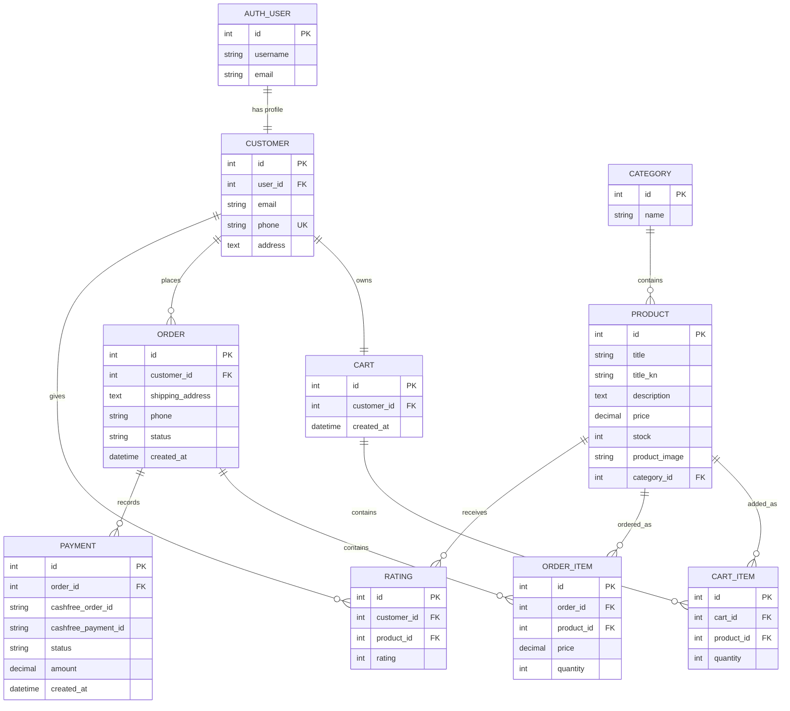
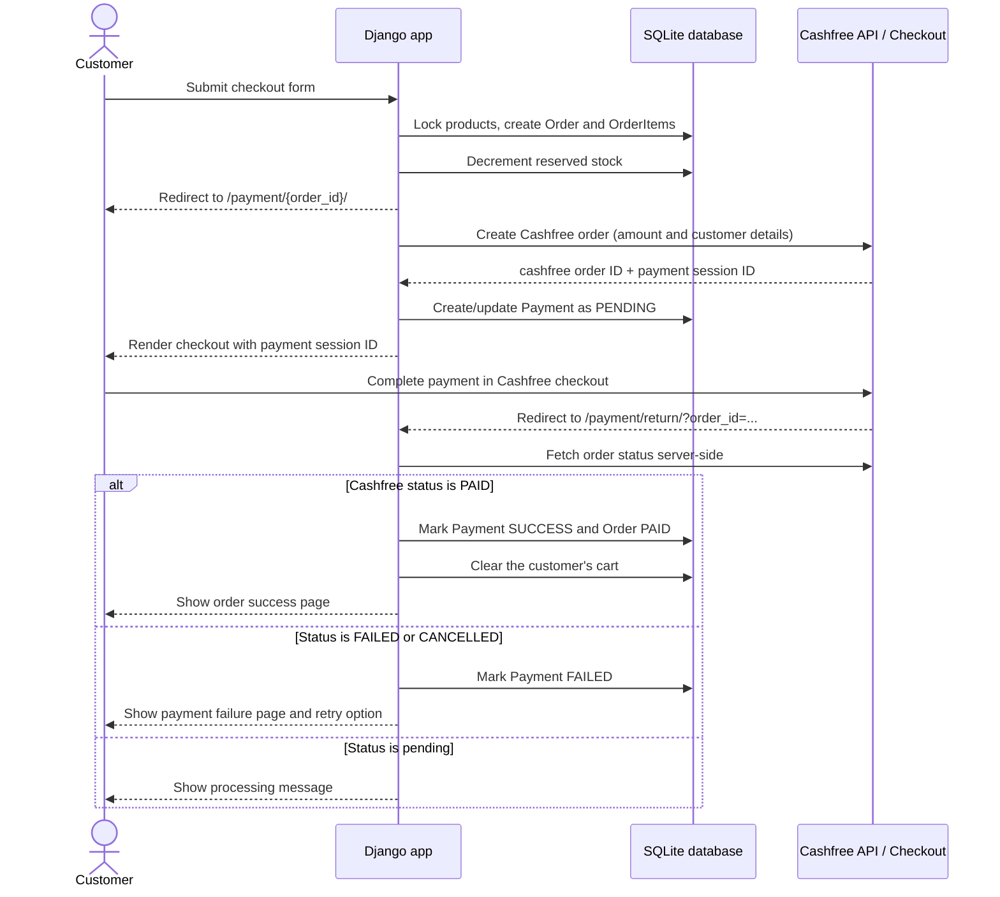

# E-Commerce Project

A Django-based e-commerce application for browsing products, managing a customer cart, placing orders, and completing online payments. It includes customer profiles, product categories and inventory, order history, ratings, invoice downloads, email tasks, and a Cashfree payment checkout integration.

The application uses SQLite for local development and stores uploaded product images under `media/`.

## Tech stack

- Python and Django
- SQLite
- Cashfree Payment Gateway
- Celery with Redis (background tasks)
- Bootstrap templates, ReportLab, and Pillow

## Database schema design

Django's built-in `auth.User` model provides authentication. The `Customer` model extends it with contact and address details.



Key rules:

- A customer has one cart; a cart can contain many items.
- A product can appear only once per cart (`cart`, `product` is unique).
- Checkout snapshots the current product price into each `OrderItem` and reserves stock inside a database transaction.
- Orders move through `PENDING`, `PAID`, `SHIPPED`, `DELIVERED`, or `CANCELED`; payments track `CREATED`, `PENDING`, `SUCCESS`, or `FAILED`.

## Directory tree

```text
.
├── manage.py                    # Django management entry point
├── requirements.txt             # Python dependencies
├── ecommerce/                   # Project configuration
│   ├── settings.py              # Database, Cashfree, email, Celery settings
│   ├── urls.py                  # Root URL routes
│   ├── asgi.py
│   ├── wsgi.py
│   └── celery.py
├── store/                       # Main e-commerce application
│   ├── models.py                # Catalog, cart, order, payment, and rating models
│   ├── views.py                 # Storefront, checkout, and payment logic
│   ├── urls.py                  # Application routes
│   ├── forms.py
│   ├── tasks.py                 # Celery tasks
│   ├── admin.py
│   ├── context_processors.py
│   ├── migrations/              # Database migrations
│   └── management/commands/     # `create_data` command
├── templates/                   # Django HTML templates
├── static/                      # Stylesheet and static images
└── media/                       # Uploaded product images
```

## Payment gateway flow

The project integrates Cashfree's JavaScript checkout in sandbox mode by default.



[Visualized ER diagram](https://miro.com/app/board/uXjVHR8FjBo=/?moveToWidget=3458764682282786316&cot=14)

Required environment variables are loaded from `.env`:

```env
SECRET_KEY=your-django-secret-key
CASHFREE_APP_ID=your-cashfree-app-id
CASHFREE_SECRET_KEY=your-cashfree-secret-key
# Optional; defaults are shown below.
CASHFREE_API_VERSION=2025-01-01
CASHFREE_BASE_URL=https://sandbox.cashfree.com/pg
EMAIL_HOST_USER=your-email-address
EMAIL_HOST_PASSWORD=your-email-app-password
OPENAI_API_KEY=your-openai-api-key
```

> The return URL is verified against Cashfree's Orders API before the local order is marked as paid. For production-grade reliability, add and verify a Cashfree webhook so payment updates do not depend only on the customer returning to the site.

## Run locally

```bash
python -m venv .venv
.venv\\Scripts\\activate
pip install -r requirements.txt
python manage.py migrate
python manage.py runserver
```

Open `http://127.0.0.1:8000/` in a browser.
